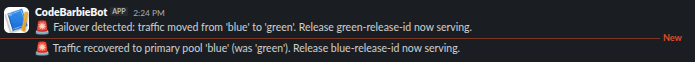
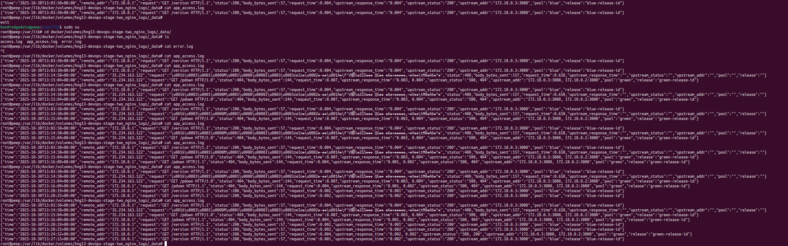

# Blue/Green Node.js Failover Stack

This repository provisions a blue/green deployment of pre-built Node.js services behind an Nginx reverse proxy. Blue handles traffic by default, while Green remains on standby. If the active pool fails (timeouts or 5xx), Nginx retries the request against the backup so the client still sees a successful response.

## Prerequisites
- Docker Engine 20.10+
- Docker Compose plugin (v2+)

## Configuration
1. Copy the sample configuration:
   ```bash
   cp .env.example .env
   ```
2. Edit `.env` and provide the required container images and release IDs:
   - `BLUE_IMAGE` – image for the blue pool
   - `GREEN_IMAGE` – image for the green pool
   - `ACTIVE_POOL` – `blue` or `green` (controls which pool is primary)
   - `RELEASE_ID_BLUE`, `RELEASE_ID_GREEN` – release identifiers returned by each service
   - `SLACK_WEBHOOK_URL` – incoming webhook for Slack alerts
   - Optional alert tuning variables (`ALERT_ERROR_WINDOW`, `ALERT_ERROR_THRESHOLD`,
     `ALERT_COOLDOWN_SECONDS`, `MAINTENANCE_FLAG_FILE`)
   - Optional `PORT` if the application inside the containers listens on a non-default port (defaults to 3000)

## Running the stack
```bash
docker compose up -d
```

Key endpoints:
- Public entry point (through Nginx): `http://localhost:8080`
- Blue direct access: `http://localhost:8081`
- Green direct access: `http://localhost:8082`

## Manual failover test
1. Confirm the active pool:
   ```bash
   curl -i http://localhost:8080/version
   ```
   The response headers include `X-App-Pool` and `X-Release-Id`.
2. Trigger chaos on the active pool (example for blue):
   ```bash
   curl -X POST "http://localhost:8081/chaos/start?mode=error"
   ```
3. Subsequent requests to `http://localhost:8080/version` should switch to the backup pool with zero failed responses.
4. Stop chaos when finished:
   ```bash
   curl -X POST http://localhost:8081/chaos/stop
   ```

## Automated verification
The script `scripts/verify_failover.sh` automates the scenario above. Run it after the stack is up:
```bash
./scripts/verify_failover.sh
```
The script waits for the baseline state, injects chaos on the active pool, and ensures that >=95% of responses during the test window come from the standby pool with no non-200 statuses.

## Operations Runbook

For alert handling guidance (failovers, high error rates, maintenance mode), see
[`RUNBOOK.md`](RUNBOOK.md).

## Alert & Log Samples

1. Slack Alert – Failover Event  
   
2. Slack Alert – High Error Rate  
   
3. Container Logs  
   

## Continuous integration
A GitHub Actions workflow (`.github/workflows/verify.yml`) launches the compose stack, runs the verification script, and collects logs on failure. Configure the following repository variables or secrets so the workflow can populate `.env`:
- `BLUE_IMAGE`
- `GREEN_IMAGE`
- `ACTIVE_POOL`
- `RELEASE_ID_BLUE`
- `RELEASE_ID_GREEN`
- Optional `PORT`

Pushes to `main` and pull requests automatically run the verification to guard against regressions in the deployment configuration.
